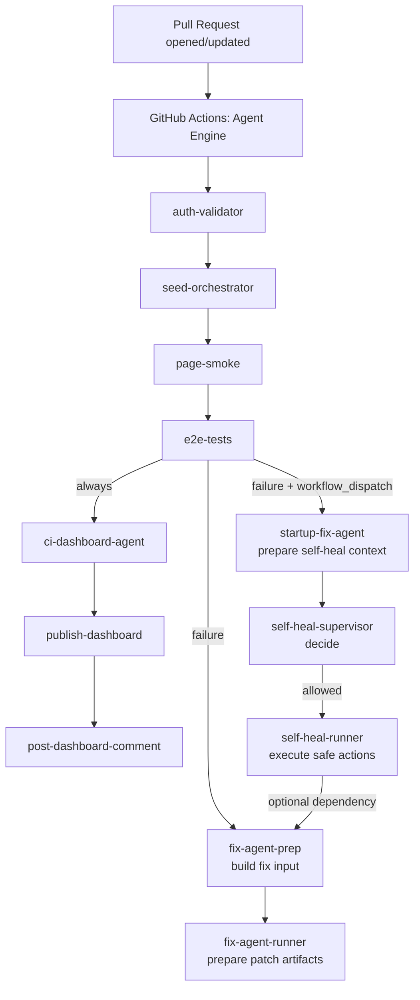
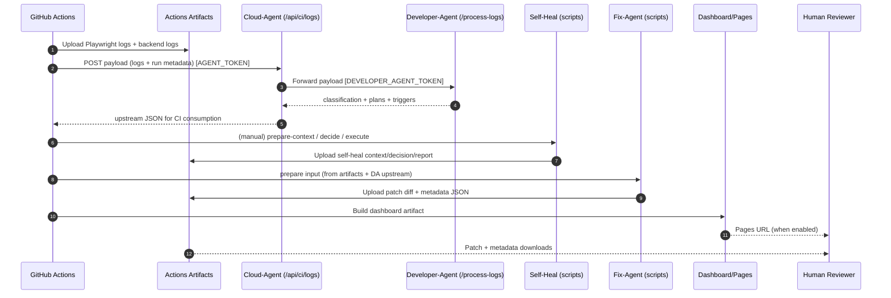

# Agent-Driven Architecture (PraxiApp)

## Overview

This repository implements an agent-driven CI system intended to operate as a mostly autonomous “agent firm”:

- CI runs deterministic checks (backend bootstrap + E2E).
- Logs are always preserved as artifacts.
- A Cloud-Agent endpoint receives CI logs and forwards them to a Developer-Agent.
- The Developer-Agent classifies failures and produces structured action plans.
- A Self-Heal pipeline can attempt safe, non-code interventions (rerun-only + environment reset).
- A Fix-Agent pipeline can prepare PR-ready code patches as artifacts (no direct push / no PR creation by default).
- A dashboard/reporting layer aggregates outputs into a human-consumable view.

Primary intent: keep the *main CI signal* focused on “tests pass/fail”, while agents run best-effort, produce structured remediation outputs, and preserve evidence.

## High-Level Architecture

### Layered view

- **CI/CD layer (GitHub Actions)**
  - Orchestration workflow: `.github/workflows/agent-engine.yml`
  - Reusable backend bootstrap: `.github/workflows/backend-setup.yml`

- **Cloud-Agent (Vercel)**
  - CI log receiver + forwarder: `POST /api/ci/logs` implemented in `api/ci/logs.ts`

- **Developer-Agent (Vercel / serverless)**
  - Log processor: `POST /process-logs` implemented in `api/process-logs.ts`
  - Responsibilities: validate, store logs, classify, produce self-heal plan + fix instructions

- **Self-Heal pipeline**
  - Scripts: `tools/self-heal/*`
  - Workflow jobs: `startup-fix-agent` → `self-heal-supervisor` → `self-heal-runner`
  - Constraint: no code edits; safe reversible actions only

- **Fix-Agent pipeline**
  - Scripts: `tools/fix-agent/*`
  - Workflow jobs: `fix-agent-prep` → `fix-agent-runner`
  - Output: patch diff + metadata (PR-ready), no push/PR by default

- **Dashboard / reporting**
  - Artifact generation: `ci-dashboard-agent` job
  - Publishing: `publish-dashboard` (GitHub Pages; best-effort when dashboard artifact exists)
  - PR comment: `post-dashboard-comment` (PR runs only)

- **Human control points**
  - Approve/merge patches produced by Fix-Agent.
  - Trigger manual runs (`workflow_dispatch`) for Self-Heal.
  - Optional enablement of public cloudflared tunnel (manual input gate).

### Diagram: CI/CD + Agents (control flow)

## Components

### CI/CD: Agent Engine workflow

Workflow: `.github/workflows/agent-engine.yml`

Core jobs (happy path):
- `auth-validator`: prepares auth/storage state for E2E.
- `seed-orchestrator`: ensures baseline data.
- `page-smoke`: lightweight smoke check.
- `e2e-tests`: Playwright run; always uploads `logs/playwright.log`, `playwright-report/`, `test-results/`.

Agent jobs:
- Self-Heal (manual gate): `startup-fix-agent` → `self-heal-supervisor` → `self-heal-runner`.
- Fix-Agent (best-effort): `fix-agent-prep` → `fix-agent-runner`.
- Reporting: `ci-dashboard-agent` + `publish-dashboard` + `post-dashboard-comment`.

Design constraint:
- Agent jobs are **best-effort** and should not flip the primary CI signal.

### CI/CD: Reusable backend bootstrap

Workflow: `.github/workflows/backend-setup.yml`

Responsibilities:
- Provision postgres service.
- Install Python + Node + Playwright (Chromium only).
- Apply migrations and seed baseline.
- Start Django and verify `/api/health/`.
- Run a single `agent_command` provided by caller.
- Upload logs artifact `backend-logs-*`.

Integration hook:
- Optional “Download extra artifact” inputs to inject self-heal/fix-agent bundles into the runner workspace.

### Cloud-Agent (Vercel)

Endpoint:
- `POST /api/ci/logs` (implementation: `api/ci/logs.ts`)

Auth:
- Incoming bearer token required: `AGENT_TOKEN`.

Behavior:
- Validates payload schema.
- Forwards payload to Developer-Agent `/process-logs` using `DEVELOPER_AGENT_TOKEN`.
- Returns Developer-Agent JSON to CI as `{ status: 'received', upstream: <Developer-Agent response> }`.

### Developer-Agent (Vercel)

Endpoint:
- `POST /process-logs` (implementation: `api/process-logs.ts`)

Auth:
- Incoming bearer token required: `DEVELOPER_AGENT_TOKEN`.

Responsibilities:
- Strict payload validation; structured 400 errors on missing fields.
- Persist logs under `logs/<run_id>/...`.
- Classify failures and emit:
  - `classification` (error type + confidence)
  - `self_heal_plan`
  - `fix_agent_instructions`
  - `triggers` (structured downstream hooks)

### Self-Heal (safe, non-code)

Scripts:
- `tools/self-heal/prepare-context.mjs`
- `tools/self-heal/decide.mjs`
- `tools/self-heal/execute.mjs`

Responsibilities:
- Build structured self-heal context (include logs + Developer-Agent classification/plan).
- Enforce policy gating (only eligible error types; rerun-only).
- Execute safe actions only (e.g. reseed DB, regenerate storage state) and rerun Playwright subset/full.

Outputs:
- `self-heal/context.json`
- `self-heal/decision.json`
- `self-heal/report-<run_id>.json`

Guardrails:
- Triggered only on `workflow_dispatch` + E2E failure.
- Max attempts enforcement (no infinite loops).
- No code edits.

### Fix-Agent (code changes as artifacts)

Scripts:
- `tools/fix-agent/prepare-input.mjs`
- `tools/fix-agent/apply-and-validate.mjs`

Responsibilities:
- Consume structured Developer-Agent output (classification + fix instructions + snippets).
- Apply **scoped** edits only (tests/selectors/small localized backend).
- Enforce size and scope guardrails.
- Run minimal validation when safe (subset Playwright rerun for relevant cases).

Outputs (artifact-friendly, PR-ready):
- `fix-agent/patch-<run_id>.diff`
- `fix-agent/metadata-<run_id>.json`
  - suggested branch name
  - commit message
  - PR title
  - PR body
  - guardrail decisions
  - validation result

Constraint:
- No direct push to main; no PR creation by default.

### Dashboard / Reporting

Jobs:
- `ci-dashboard-agent` generates `dashboard` artifact.
- `publish-dashboard` best-effort publishes to GitHub Pages if enabled and artifact exists.
- `post-dashboard-comment` (PR-only) comments a link to the dashboard.

## End-to-End Flow (Happy Path)

1) PR opened / updated.
2) GitHub Actions runs `.github/workflows/agent-engine.yml`.
3) Backend bootstrap + checks execute in order via `.github/workflows/backend-setup.yml`:
   - `auth-validator` → `seed-orchestrator` → `page-smoke` → `e2e-tests`.
4) Artifacts are uploaded:
   - Playwright logs/report/test-results
   - Backend logs (`django/logs/...`) for each backend-setup invocation
   - Agent JSON outputs (`*-output` artifacts)
5) Logs are shipped to Cloud-Agent:
   - `send-ci-logs` job posts payload to `POST /api/ci/logs` (best-effort).
6) Cloud-Agent forwards to Developer-Agent:
   - Developer-Agent stores logs, classifies failure, and returns structured plans.
7) Self-Heal (manual only) optionally runs:
   - context → decide → execute safe actions and rerun
   - outputs `self-heal/report-<run_id>.json`
8) Fix-Agent prepares code changes (best-effort):
   - build `fix-agent/input.json`
   - apply guarded fixes
   - emit `fix-agent/patch-<run_id>.diff` and `fix-agent/metadata-<run_id>.json`
9) Dashboard aggregates and publishes:
   - `ci-dashboard-agent` produces `dashboard` artifact
   - `publish-dashboard` posts to Pages when enabled
   - `post-dashboard-comment` links dashboard on PRs
10) Human reviews:
   - downloads Fix-Agent patch artifacts
   - reviews metadata suggestions
   - decides whether to apply, amend, and merge

## Diagram: Data / Log Flow

## Failure Modes and Resilience

### GitHub Actions / CI/CD

Failure modes:
- Dependency install drift/timeouts (pip/npm/Playwright downloads).
- Postgres service health delays.
- Django server startup/health endpoint failures.
- E2E flakiness (timing, network).

Degradation strategy:
- Core jobs fail the run when they are the primary signal (e2e-tests failing should fail the run).
- Non-critical jobs use best-effort patterns (`continue-on-error` and “if exists” checks) to avoid noise.
- Artifacts are always uploaded where possible to preserve evidence.

Signals preserved:
- Backend logs in `backend-logs-*` artifacts.
- Playwright logs in `test-results` artifact.

Human intervention:
- Re-run jobs in Actions.
- Download artifacts and debug locally.

Single points of failure:
- GitHub-hosted runner availability and network.

Guards/timeouts:
- Explicit workflow timeouts per job.
- Playwright install and forwarder timeouts.

### Cloud-Agent

Failure modes:
- Vercel downtime/cold start/timeouts.
- Misconfigured env vars (`AGENT_TOKEN`, `DEVELOPER_AGENT_URL`, `DEVELOPER_AGENT_TOKEN`).

Degradation strategy:
- CI continues even if log upload fails (best-effort in `send-ci-logs`).
- Artifacts still exist as the primary source of truth.

Signals preserved:
- All evidence remains in Actions artifacts even if Cloud-Agent is unavailable.

Human intervention:
- Inspect Vercel function logs.
- Redeploy or fix env configuration.

Single points of failure:
- Cloud-Agent endpoint availability.

Retry/backoff needs:
- CI-to-Cloud-Agent POST should use timeouts and tolerate transient 5xx.

### Developer-Agent

Failure modes:
- Vercel downtime/cold start/timeouts.
- Storage write errors.
- Misconfigured token.

Degradation strategy:
- Cloud-Agent surfaces forwarding failures to CI.
- Self-Heal/Fix-Agent still can run in “artifact-only” mode (inputs may be missing classification/instructions).

Signals preserved:
- Actions artifacts remain intact.
- Developer-Agent storage contains logs/analysis when available.

Human intervention:
- Review `logs/<run_id>/analysis.json` when accessible.
- Redeploy / rotate tokens.

Single points of failure:
- Developer-Agent availability for classification.

Retry/backoff needs:
- Cloud-Agent forward request should use timeouts (already bounded) and optionally retries.

### Self-Heal

Failure modes:
- Missing secrets (`AGENT_TOKEN`) → cannot fetch classification.
- Missing artifacts → cannot build context.
- Rerun still fails due to structural issue.

Degradation strategy:
- Self-Heal produces context/decision artifacts even when classification is missing.
- Self-Heal is gated behind manual intent (`workflow_dispatch`).

Signals preserved:
- `self-heal/context.json`, `self-heal/decision.json`, `self-heal/report-<run_id>.json` artifacts.

Human intervention:
- Read report and decide escalation to Fix-Agent.

Single points of failure:
- None; it is optional and best-effort.

Guards/timeouts:
- Eligibility policy (error types) and max attempt constraints prevent loops.

### Fix-Agent

Failure modes:
- Missing classification/instructions → no edits.
- Guardrails triggered (diff too big) → revert and emit empty patch.
- Minimal validation fails → patch still produced, flagged “needs manual review”.

Degradation strategy:
- Always emits patch + metadata artifacts.
- Does not fail main CI.

Signals preserved:
- `fix-agent/patch-<run_id>.diff` and `fix-agent/metadata-<run_id>.json` artifacts.

Human intervention:
- Apply patch locally and adjust.
- Convert patch into a PR using a separate human/bot step.

Single points of failure:
- None; patch generation is best-effort.

Guards/timeouts:
- Scope-limited path allowlist.
- File/line caps.
- Minimal validation bounded to a small subset.

### Dashboard / Reporting

Failure modes:
- Dashboard artifact missing.
- GitHub Pages not enabled.

Degradation strategy:
- Publishing skips gracefully.
- Evidence remains in artifacts.

Human intervention:
- Enable Pages in repo settings.
- Use artifacts locally.

## Autonomy Roadmap

### Stage 1 — Assisted autonomy (current target)

Workflow changes:
- Keep Fix-Agent and Self-Heal best-effort.
- Produce patch + metadata artifacts only.
- Human applies patch and opens PR.

Agent changes:
- Improve fix precision using structured hints (selectors, timeouts, localized backend fixes).
- Expand validation matrix only when fast.

Guardrails:
- Strict path allowlists.
- Diff size caps.
- Always keep artifacts as primary evidence.

### Stage 2 — Conditional autonomy (auto-PR + gated auto-merge)

Workflow changes:
- Add an explicit PR creation job that:
  - creates a branch,
  - applies the patch,
  - opens a PR targeting the same PR branch or a fix branch.
- Add rules to auto-merge only when:
  - patch touches only tests/selectors,
  - diff is small,
  - validation passes,
  - and owner/label approvals exist.

Agent changes:
- Add risk scoring to metadata (e.g., “test-only”, “backend-only”, “auth/session”).
- Add deterministic reproduction checks before proposing changes.

Guardrails:
- Require CODEOWNERS approval for non-test files.
- Enforce “green after fix” requirement (rerun CI on the PR).
- Rate-limit PR creation to avoid spam.

### Stage 3 — Full autonomy (optional; periodic audit)

Workflow changes:
- Enable automatic PR creation + merge for low-risk classes.
- Add scheduled audits and rollbacks:
  - periodic review runs,
  - automated revert PRs when regressions detected.

Agent changes:
- Maintain a fix history and avoid repeating failing strategies.
- Use canary branches and progressive rollout of agent policies.

Guardrails:
- Multi-signal approvals (tests + static checks + risk policy).
- Blast-radius controls (limit concurrent agent PRs).
- Mandatory periodic human audit windows.

---

## Appendix: Key Endpoints and Secrets

- Cloud-Agent endpoint: `POST /api/ci/logs`
  - Requires `AGENT_TOKEN` (incoming auth)
  - Requires `DEVELOPER_AGENT_URL` + `DEVELOPER_AGENT_TOKEN` (forwarding)

- Developer-Agent endpoint: `POST /process-logs`
  - Requires `DEVELOPER_AGENT_TOKEN` (incoming auth)

- CI secrets:
  - GitHub Actions: `AGENT_TOKEN`
  - Vercel env: `AGENT_TOKEN`, `DEVELOPER_AGENT_URL`, `DEVELOPER_AGENT_TOKEN`
